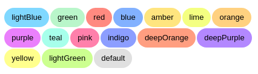

# Mui-Pastel

> Automatic or manual Good looking and customizable chip component


## Demo



#### [Demo and examples](http://nikandlv.github.io/mui-pastel)

## Install it

```console
nikandlv@nikandlv.ir:~$ npm i mui-pastel
```

## Import it

```javascript
import Pastel from "mui-pastel";
```

## Automatic chip

```jsx
<Pastel label="Automatic!" />
```

## Manual chip

```jsx
<Pastel label="I love amber!" color="amber" />
```

> Pastel uses `@material-ui/core/Chip` internally and any props will pass to it

## Small chip

```jsx
<Pastel label="I love amber!" color="amber" size="small" />
```
